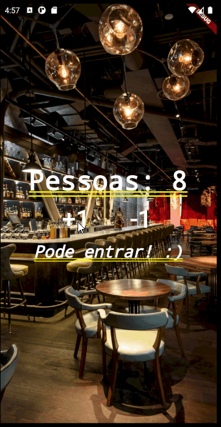
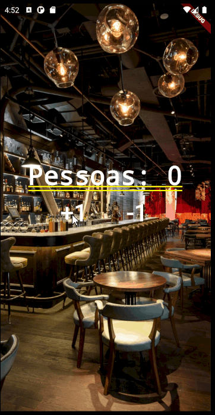

# contador_de_pessoas

This is a basic aplication that count a number of peoples in a restaurant.

    &nbsp;&nbsp;&nbsp;&nbsp;  

## Technologies
 - ✔ Git.
 - ✔ AndroidStudio.
 - ✔ Flutter.
 - ✔ Dart.

## Flutter links

A few resources to get you started if this is your first Flutter project:

- [Lab: Write your first Flutter app](https://flutter.dev/docs/get-started/codelab)
- [Cookbook: Useful Flutter samples](https://flutter.dev/docs/cookbook)
- [online documentation](https://flutter.dev/docs)

